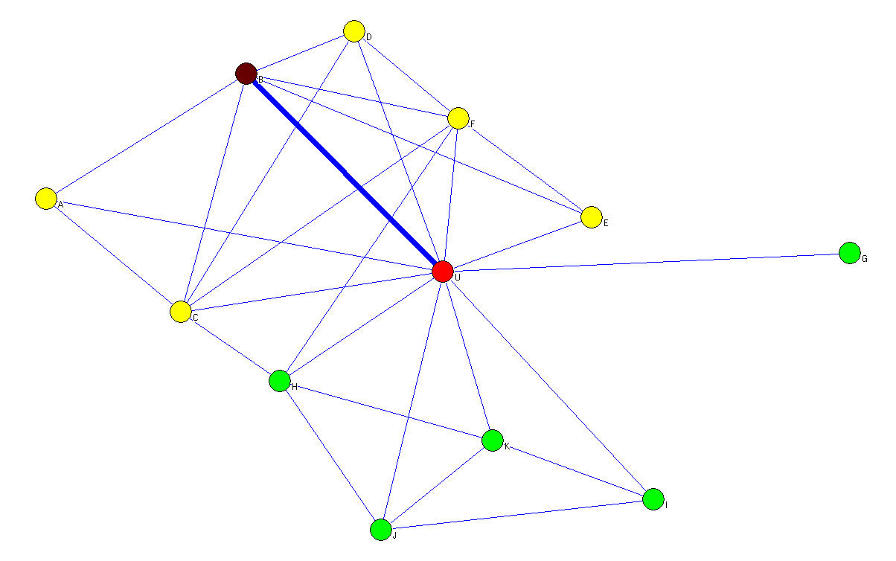
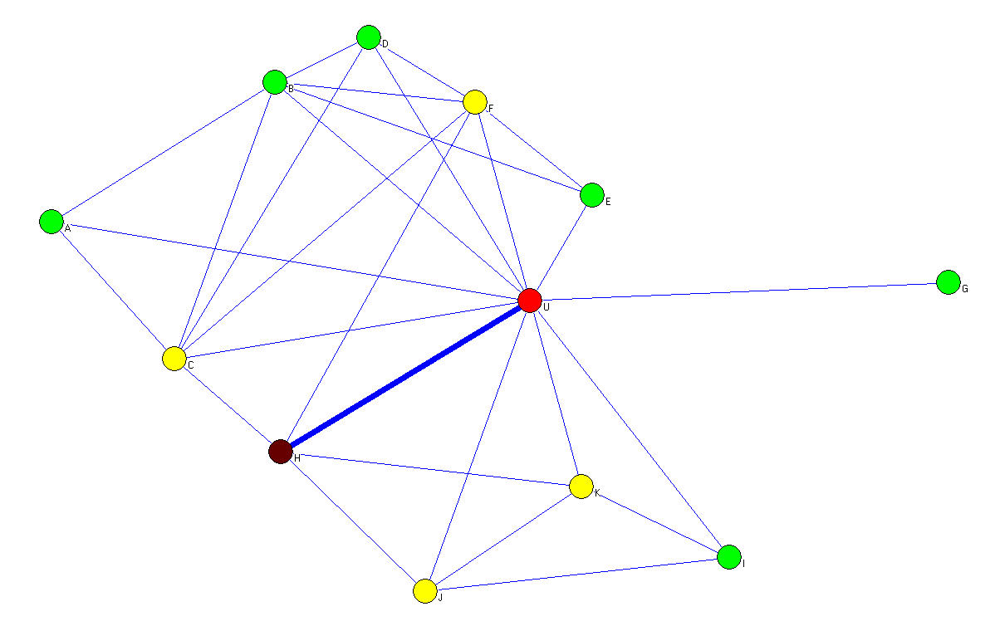
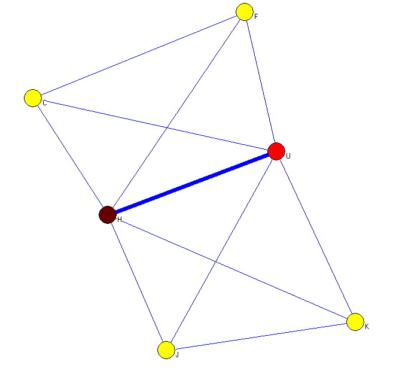
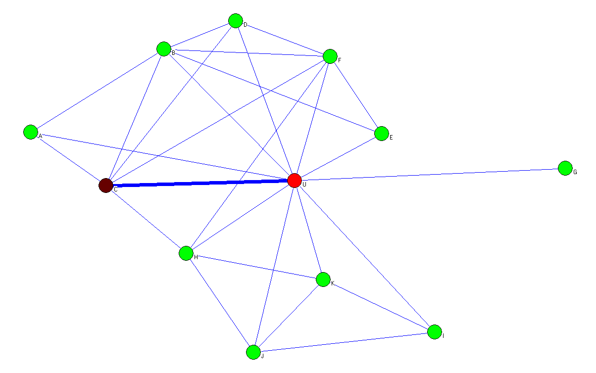

<table> 
<tr><td></td> 
     <td></td> 
</tr> 
</table> 

 

The goal is that, given a person $U$, we want to find whether an friend of $U$ is his/her romantic partner.
We can predict whether $U$ and a friend $V$ is romantic partner based on embeddedness, defined as the number of common friends between $U$ and $V$.
Then, given $u$

- in the first plot, embeddedness between $U$ and $B$ is 5 (yellow nodes are common friends)
- in the second plot, embeddedness between $U$ and $H$ is 4 (yellow nodes are common friends) 

We will think that $U$ and $B$ will be more likely to be partner than with $H$. But we may actually see that $U$ and $B$ are in the same foci, which makes them have more common friends.
So Backstrom and Kleinberg invented the idea of dispersion.

Dispersion, $disp(U,V)$: the set of all common friends of $U$ and $V$ is $C_{UV}$. (yellow nodes in the image!)
Then, for each pair of node $s,t$ in common neighbors 
$$disp(U,V) = \sum_{s,t \in C_{UV}} d_{st}$$ 

$d_{st}$ is 1, if there is 

1. No direct link betwen $s$ and $t$ 
2. No other common friends which is also $U$'s friend 

or otherwise $d_{st}=0$, which suggest that $s,t$ may belong to the same foci and are not "dispersed".

 

- In the third plot, $disp(U,H)$=4: there are four pairs whose $d$ is 1: $(F,K)$,$(F,J)$,$(C,J)$,$(C,K)$.
- In the fourth plot, $disp(U,H)$=1: there is only one pair whose $d$ is 1: $(A,E)$.
      - all other pairs, such as $(A,D)$ have common friend $C$ who is also $U$'s friend; $(F,E)$ are directly linked.

**Now, exercise:**

see next two plots, what is the number of embeddedess, and dispersion for $(U,C)$ link ? Do you think $(U,C)$ or $(U,H)$ is morely likely to be a romantic relation?

 

